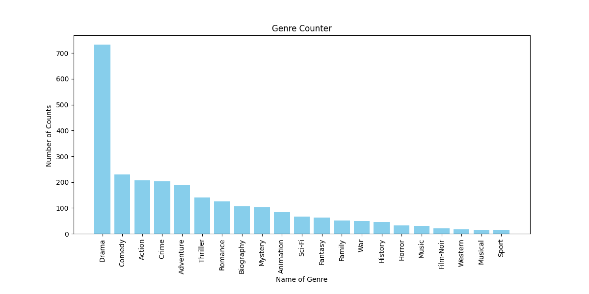

# IMDB En İyi 1000 Film Analizi 🎬📊

Bu proje, IMDb'nin En İyi 1000 Filmi listesindeki verilerini analiz etmektedir. Python, Pandas, Matplotlib ve Seaborn kullanarak çeşitli veri görselleştirme teknikleri uygulanmıştır.

---

## 📌 Kullanılan/Kullanılacak Teknolojiler

- Bu projede aşağıdaki Python kütüphaneleri kullanılmıştır:

  - **pandas** → Veri okuma, temizleme ve analiz  
  - **matplotlib** → Grafikler oluşturma  
  - **seaborn** → Veri görselleştirme  

---

## 🚀 Kurulum ve Kullanım

Bu projeyi çalıştırmak için aşağıdaki adımları takip edebilirsiniz:

**Bu repoyu klonlayın:**
```bash
git clone https://github.com/EmircanG78/IMDB-Top-1000-Movies.git
```

**Gerekli kütüphaneleri yükleyin:**
```bash
pip install pandas matplotlib seaborn
```

**Python dosyasını çalıştırın:**
```bash
python Films.py
```

---

## 📊 Örnek Çıktılar

Bu analiz kapsamında IMDb film türlerinin dağılımı aşağıdaki gibidir:

### 🎭 Film Türlerinin Dağılımı:

| Tür      | Film Sayısı |
|----------|------------|
| Drama    | 700+       |
| Komedi   | 220        |
| Aksiyon  | 200        |
| Suç      | 190        |
| Macera   | 180        |

---

## 📈 Örnek Grafik:

Aşağıda **IMDb En İyi 1000 Filmlerindeki Türlerin Dağılımını** gösteren bir çubuk grafik bulunmaktadır:



---

## 🔮 Gelecekte Eklenecek Özellikler

- 🎭 IMDb puanı ve film türleri arasındaki ilişki analizi  
- 📈 Filmlerin yıllara göre dağılımı  
- 🔍 En popüler yönetmenlerin analizi  

Bu proje hakkında geri bildirim vermek veya katkıda bulunmak isterseniz lütfen bana ulaşın! 🚀

